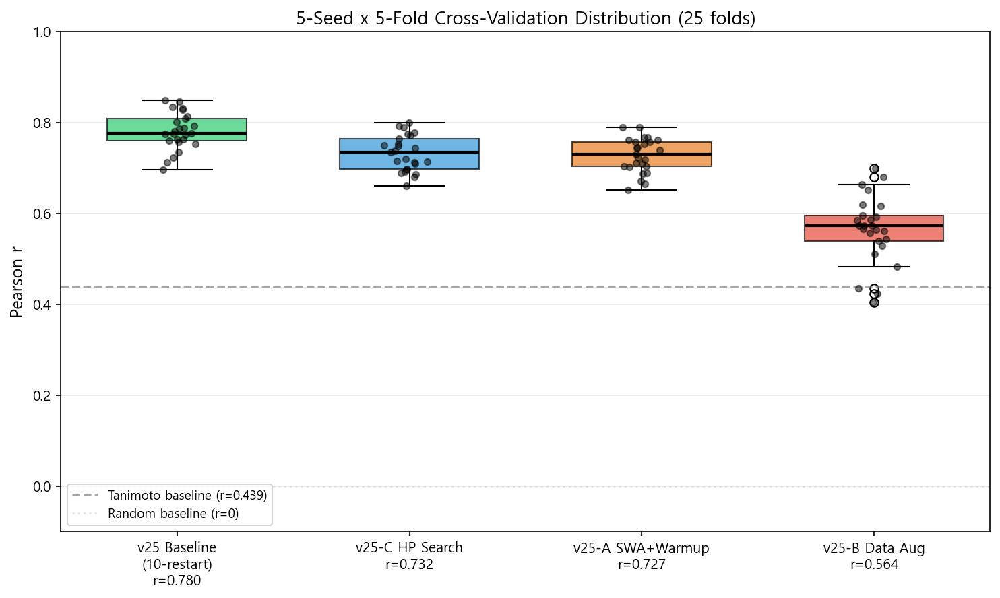
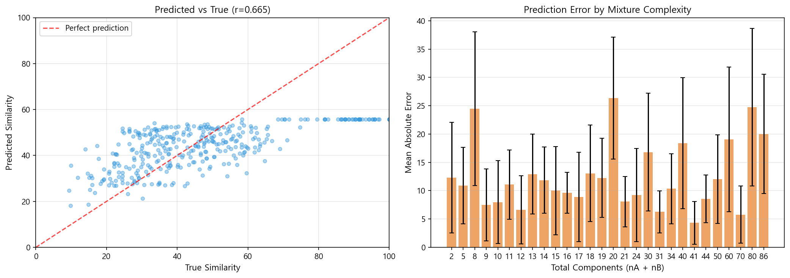
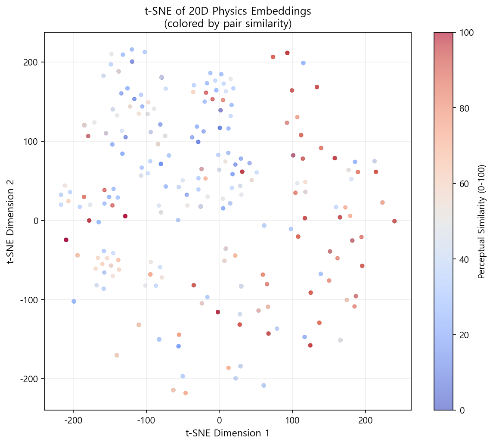

# OlfaBind: Olfactory Competitive Binding Network를 활용한 혼합물 유사도 예측

## 개요

OlfaBind는 분자 지문(Molecular Fingerprint)을 천체역학 시뮬레이션에 매핑하여 후각 혼합물 간의 지각적 유사도를 예측하는 물리 기반 신경망이다. 기존의 그래프 신경망(GNN) 기반 접근법과 달리, OlfaBind는 분자를 질량, 위치, 속도를 가진 천체(Celestial Body)로 변환한 뒤 N-body 중력 시뮬레이션을 수행하고, 궤도 안정성 분석을 통해 혼합물의 물리적 임베딩을 추출한다.

본 저장소는 OlfaBind 모델의 아키텍처 설계, 학습 전략 탐색, 대조 학습(Contrastive Learning) 실험, 물리 기반 손실 함수 실험 등 총 9개 버전(v17~v25)에 걸친 체계적인 실험 기록을 포함한다.

## 동기: 왜 중력 시뮬레이션인가

후각 혼합물의 지각적 유사도는 구성 분자들의 비결합 상호작용(non-covalent interaction)에 의해 결정된다. 분자 간 상호작용은 거리의 역제곱에 비례하는 van der Waals 힘으로, 이는 중력의 수학적 구조와 동형(isomorphic)이다. 이 유사성에 착안하여, 분자를 질량체로 모델링하고 N-body 시뮬레이션을 수행하면 분자 간 상호작용의 동역학적 특성을 end-to-end 학습 가능한 형태로 포착할 수 있다.

중력 시뮬레이션의 장점:
- 가산성(additivity): 혼합물의 특성은 구성 분자들의 상호작용 합으로 자연스럽게 표현됨
- 순서 불변성(permutation invariance): N-body 시뮬레이션은 입력 순서에 무관
- 물리적 귀납 편향(inductive bias): 시뮬레이션이 시간에 따른 궤적을 생성하므로, 안정성/에너지 등 물리적으로 의미 있는 특징이 자동으로 추출됨
- 미분 가능성: Verlet 적분으로 구현하여 역전파(backpropagation)를 통한 end-to-end 학습이 가능

## 관련 연구

후각 예측 및 물리 기반 신경망 분야의 관련 연구:

분자 표현 학습: Morgan Fingerprint(ECFP)는 원형 부분구조의 존재를 이진 벡터로 인코딩하는 고전적 방법이다. 최근에는 GNN 기반 학습된 표현(Gilmer et al., 2017; Yang et al., 2019)이 우세하나, 혼합물 수준의 표현에는 집합 연산(pooling)이 필요하여 분자 간 상호작용을 직접 모델링하지 못한다.

후각 예측 모델: Principal Odor Map(POM, Lee et al., 2023)은 GNN으로 단일 분자의 냄새 설명자를 예측하여 AUROC 0.79를 달성하였다. 그러나 POM은 단일 분자 예측에 특화되어 혼합물 수준의 상호작용 모델링에는 한계가 있다. DREAM Olfaction Challenge(Keller et al., 2017)에서 혼합물 유사도 예측 과제가 제시되었으나, 대부분의 참가팀은 분자 수준 특징의 단순 평균으로 혼합물을 표현하였다.

물리 기반 신경망: Hamiltonian Neural Networks(Greydanus et al., 2019)는 에너지 보존을 구조적으로 보장하고, Neural Relational Inference(Kipf et al., 2018)는 N-body 시스템의 상호작용을 학습한다. Physics-Informed Neural Networks(PINN, Raissi et al., 2019)는 물리 법칙을 손실 함수로 활용한다. OlfaBind는 이들과 달리 시뮬레이션 자체를 특징 추출기로 사용하며, 물리 법칙 준수를 강제하지 않는다.


## 아키텍처


### 파이프라인 구조

OlfaBind 시스템은 3개의 핵심 모듈로 구성된다.

### Module 1: InputHardwareLayer (입력 하드웨어 계층)

분자 지문을 물리 시뮬레이션에 적합한 내부 표현으로 변환한다.

1. Fingerprint Grid Mapping: 2048차원 Morgan Fingerprint를 8x16 격자맵으로 재구성
2. Sparse Activation: 각 격자 셀에 학습 가능한 활성화 함수를 적용하여 희소 활성 패턴(Constellation) 생성
3. Channel Transformation: 격자 패턴을 128차원 원자 벡터(d_atom=128)로 변환

이 과정을 통해 각 분자는 128차원 벡터로 인코딩된다. 혼합물은 최대 20개 분자의 집합으로 표현되며, 유효하지 않은 슬롯은 마스킹된다.

### Module 2: PhysicsProcessingEngine (물리 처리 엔진)

#### 2.1 ConstellationToCelestial (매핑)

128차원 원자 벡터를 물리량으로 변환한다:
- 질량 (Mass, 1D): Softplus 함수로 양수 보장, clamp(max=5.0)
- 위치 (Position, 3D): tanh() x 2.0으로 [-2, 2] 범위
- 속도 (Velocity, 3D): tanh() x 0.5로 [-0.5, 0.5] 범위

이 매핑은 단일 선형 계층(Linear)으로 구현되며, v24 실험에서 MLP로 교체 시 성능 저하가 관찰되어 단순 선형 매핑이 최적임을 확인하였다.

#### 2.2 GravitationalEngine (중력 엔진)

N-body 중력 시뮬레이션을 기울기 추적(gradient tracking)이 가능한 미분 가능 연산으로 구현한다.

가속도 계산:

```
a_i = G * Σ_j [ m_j * (r_j - r_i) / (||r_j - r_i||^2 + ε)^(3/2) ]
```

Verlet 적분에 의한 위치/속도 갱신:

```
v_i(t+1) = v_i(t) + a_i(t) * dt
r_i(t+1) = r_i(t) + v_i(t+1) * dt
```

여기서 G = exp(log_G)는 학습 가능한 중력 상수, ε = 0.01은 수치 안정성을 위한 softening 파라미터이다.

주요 설계:
- 학습 가능한 중력 상수: log_G (nn.Parameter)
- 가속도 클램핑: 수치 안정성을 위한 accel_clamp=100.0
- 질량 감쇠: 시뮬레이션 진행에 따라 질량이 점진적으로 감소
- 궤적 기록: 전체 시간 스텝의 위치를 (B, T, N, 3) 텐서로 기록

시뮬레이션 파라미터는 n_steps=4, dt=0.05가 최적이며, T=8 이상에서는 수치 불안정이 증가한다.

#### 2.3 OrbitalStabilityEvaluator (궤도 안정성 평가기)

시뮬레이션 궤적으로부터 20차원 물리 임베딩을 추출한다.

추출되는 물리 특징:
- 궤도 안정성 점수 (1D): 스펙트럼 분석 기반
- 고유값 기반 스펙트럼 지문 (8D): 상호작용 행렬의 고유값
- 평균 질량, 속도, 각운동량 (3D)
- 운동/위치 에너지 비율 (2D)
- 궤적 변동성 지표 (6D): 분산, 쌍별 거리 등

### Module 3: Similarity Prediction (유사도 예측)

두 혼합물의 물리 임베딩 차이를 기반으로 유사도를 예측한다.

1. Projection: 20D -> 64D (Linear + LayerNorm + GELU)
2. Absolute Difference: |P_A - P_B|
3. Similarity Head: 64D -> 32D -> 1D (MLP + sigmoid)

수식으로 표현하면:

```
p_A = Proj(φ(A)),  p_B = Proj(φ(B))    (φ: 물리 임베딩 추출)
ŝ = σ(MLP(|p_A - p_B|))                (σ: sigmoid)
L = (1/N) * Σ (ŝ_i - s_i)^2 + λ * L_sparsity
```

여기서 s_i는 정규화된 ground truth 유사도(0~1), λ=0.01은 sparsity 정규화 가중치이다.

## 학습 과정


### Multi-Restart Training

OlfaBind의 손실 지형(loss landscape)은 다수의 국소 최솟값을 포함하여 단일 학습에서 최적해에 도달하는 확률이 낮다. 이를 해결하기 위해 Multi-Restart Training을 도입하였다:

1. 동일한 데이터 분할에 대해 N개의 독립적인 학습을 수행 (각각 다른 랜덤 시드)
2. 각 학습에서 검증 Pearson r 기준 최우수 모델을 선택
3. N개의 후보 중 최고 성능 모델을 최종 모델로 채택

실험 결과:
- 3-restart: r = 0.680 (v18 baseline)
- 10-restart: r = 0.780 (v25 baseline, +14.7% 향상)

Restart 횟수의 증가가 SWA, Warmup, Cosine Decay 등의 학습 기법보다 더 큰 성능 향상을 가져온다는 것이 본 실험의 핵심 발견이다.

### 하이퍼파라미터

| 파라미터 | 값 | 비고 |
|---------|-----|------|
| d_input (입력 차원) | 2048 | Morgan Fingerprint |
| d_atom (원자 벡터 차원) | 128 | |
| n_steps (시뮬레이션 스텝) | 4 | T=2~4 최적 |
| dt (시간 간격) | 0.05 | |
| Batch Size | 16 | |
| Learning Rate | 3e-4 | Adam optimizer |
| Weight Decay | 1e-4 | |
| Epochs | 60 | Early stopping (patience=15) |
| Scheduler | CosineAnnealingLR | |
| Grad Clip | 1.0 | max_norm |
| Restarts | 10 | (best selection) |

## 실험 결과


### 외부 Baseline 비교

OlfaBind의 성능을 맥락화하기 위해 외부 baseline 및 기존 연구와 비교한다.

| 방법 | Pearson r | 평가 방식 | 설명 |
|------|:---------:|:---------:|------|
| Snitz et al. (2013) 최적화 | 0.85 | Train/Test 분할 | 1433개 물리화학 서술자에서 21개를 선택, 코사인 각도 거리 기반 |
| OlfaBind v25 (10-restart) | 0.780 | 5-seed x 5-fold CV | 본 모델 (end-to-end 학습, 수작업 특징 선택 없음) |
| Snitz et al. (2013) 단순 | >=0.49 | Train/Test 분할 | 단일 구조 벡터로 혼합물 표현, 특징 선택 없음 |
| Tanimoto Similarity | 0.439 | 전체 데이터 | 평균 쌍별 Tanimoto 유사도 |
| Component Count Ratio | 0.417 | 전체 데이터 | 구성 분자 수 비율 |
| Random / Mean Prediction | ~0.0 | - | 랜덤 또는 상수 예측 |

비교 시 주의점: Snitz et al. (2013)의 r=0.85는 1433개 물리화학 서술자(분자량, LogP, 극성 표면적 등)에서 최적의 21개를 선택하는 과정이 포함되어 있으며, 단순 train/test 분할로 평가되었다. OlfaBind는 Morgan Fingerprint만을 입력으로 사용하고 수작업 특징 선택 없이 end-to-end로 학습하며, 더 엄격한 5-seed x 5-fold CV로 평가되었다. Snitz의 단순 모델(특징 선택 없음, r>=0.49)과 비교하면 OlfaBind(r=0.780)는 59% 이상의 성능 향상을 보인다.

OlfaBind의 핵심 장점은 도메인 전문가의 특징 선택(feature engineering) 없이 분자 지문에서 직접 물리 시뮬레이션을 통해 혼합물 수준의 상호작용을 학습한다는 것이다.

### 5-Seed x 5-Fold Cross-Validation (Snitz et al., 2013 데이터셋)

본 실험은 Snitz 2013 데이터셋(360 혼합물 쌍)을 사용하여 5개 시드 x 5-fold 교차 검증(총 25회)으로 평가하였다.

| 버전 | 방법론 | Pearson r | Std | 이전 대비 |
|------|--------|:---------:|:---:|:--------:|
| v25 baseline | 원본 구조 + 10-restart | 0.780 | 0.039 | +0.100 |
| v25-C | HP grid search (T, dt) | 0.732 | 0.038 | +0.052 |
| v25-A | +SWA, warmup, grad accum | 0.727 | 0.037 | +0.047 |
| v18 | 원본 구조 + 3-restart | 0.680 | - | 기준선 |
| v19 | +InfoNCE 대조 학습 | 0.594 | 0.085 | -0.086 |
| v25-B | +Bushdid 데이터 증강 | 0.565 | 0.073 | -0.115 |
| v21 | +6개 구조 개선 | 0.553 | 0.117 | -0.127 |
| v22 | +물리 기반 손실 (HNN, PINN) | 0.532 | 0.119 | -0.148 |
| v23 | +Multi-scale, Trajectory Attention | 0.520 | 0.112 | -0.160 |
| v24 | +MLP mapper, 32D embedding | 0.440 | 0.090 | -0.240 |
| v20 | +Triplet Margin Loss | 0.436 | 0.112 | -0.244 |

### 각 버전별 상세 설명

v17: OlfaBind의 최초 검증 실험. 물리 엔진의 기본 동작 확인 및 벤치마크 설정.

v18: T-sweep (시뮬레이션 길이 탐색)과 multi-restart 도입. T=4가 최적임을 확인하고, 3-restart로 r=0.680 달성. 이후 모든 실험의 baseline이 됨.

v19: SimCLR 스타일 InfoNCE 손실 함수를 추가하여 대조 학습을 시도. 같은 혼합물의 서로 다른 augmented view를 positive pair로, 다른 혼합물을 negative pair로 학습. 대조 학습 목표가 유사도 예측 목표와 상충하여 성능 하락.

v20: Triplet Margin Loss로 전환. 같은 분자의 두 augmented view를 anchor-positive로, in-batch random을 negative로 학습. 데이터 부족(360 쌍)과 과도한 margin으로 심한 성능 하락 발생.

v21: v20의 문제를 개선하기 위해 6개 기법 추가: 적응적 margin, hard negative mining, similarity-weighted loss, projection head 개선, layer-wise learning rate, validation-aware weighting. 일부 개선되었으나 여전히 baseline 이하.

v22: 대조 학습을 완전히 배제하고 물리 기반 손실 함수만 사용하는 접근법 시도. Hamiltonian Trajectory Matching (해밀턴 궤적 매칭), PINN Regularization (물리 정보 신경망 정규화), Spectral Matching (스펙트럼 매칭) 3종 적용. 높은 변동성이 관찰됨.

v23: 모델의 자유도를 극대화하면서 안정성도 강화하는 접근법. Multi-scale Simulation (T=2,4,8 동시 실행), Trajectory Attention (궤적 어텐션), 8D Latent Space (8차원 잠재 공간), 10-restart, SWA, Mixup 등 적용. 복잡도 증가가 오히려 불안정화를 유발.

v24: 내부 구조만 개선하는 보수적 접근. ConstellationToCelestial 매퍼를 2-layer MLP + LayerNorm + Residual로 교체, 물리 임베딩을 20D에서 32D로 확장. 단순 Linear 매퍼보다 성능이 악화되어, 원본 매퍼가 이미 최적임을 확인.

v25: 구조 고정, 학습/데이터/하이퍼파라미터 3가지 최적화를 병행 실험. Strategy A (학습 전략: SWA, warmup, grad accumulation), Strategy B (데이터 증강: Bushdid pseudo-similarity), Strategy C (HP search: T, dt grid). 최종적으로 원본 구조 + 원본 학습 + 10-restart가 최고 성능 달성.

### 핵심 발견

1. 물리 엔진의 아키텍처는 이미 최적에 가깝다. v19~v24에서 시도한 모든 구조 변경(대조 학습 모듈, 물리 손실 함수, MLP 매퍼, 궤적 어텐션 등)은 baseline 대비 성능을 저하시켰다.

2. Restart 횟수가 성능의 가장 큰 결정 인자다. 다른 학습 기법(SWA, warmup, cosine scheduling)의 기여는 미미했으며, 단순히 restart 횟수를 3에서 10으로 증가시킨 것만으로 r이 0.680에서 0.780으로 14.7% 향상되었다.

3. 외부 데이터는 도움이 되지 않는다. Bushdid discrimination 데이터를 pseudo-similarity로 변환하여 추가 학습에 활용한 결과, 오히려 노이즈로 작용하여 성능이 저하(r=0.565)되었다.

4. 시뮬레이션 길이 T=4가 최적이다. T=2와 비슷한 성능을 보이지만, T=8 이상에서는 수치 불안정으로 인해 급격한 성능 하락이 발생한다.

### 통계적 유의성 검정

25 folds의 paired t-test 및 Wilcoxon signed-rank test 결과:

| 비교 | Mean diff | t-stat | p-value (t) | p-value (W) | 유의성 |
|------|:---------:|:------:|:-----------:|:-----------:|:-----:|
| Baseline vs A(SWA) | +0.053 | 7.85 | 4.4e-08 | 2.6e-06 | 유의 (p<0.001) |
| Baseline vs B(Data) | +0.216 | 16.12 | 2.3e-14 | 6.0e-08 | 유의 (p<0.001) |
| Baseline vs C(HP) | +0.048 | 5.83 | 5.2e-06 | 1.0e-05 | 유의 (p<0.001) |
| A(SWA) vs C(HP) | -0.004 | -0.64 | 0.529 | 0.339 | 비유의 |

Baseline(10-restart)이 A, B, C 모두보다 통계적으로 유의하게 우수하다(p<0.001). A와 C 사이에는 유의한 차이가 없다(p=0.529).

### Fold별 분포



### 에러 분석



예측 오류가 가장 큰 경우는 true similarity=100(동일 혼합물)인 쌍이다. 이는 모델이 극단적으로 높은 유사도를 과소 예측하는 경향을 보여준다. 반면, 40~50 범위의 중간 유사도에서는 정확도가 높다.

### 물리 임베딩 시각화



20D 물리 임베딩의 t-SNE 시각화. 유사도가 높은 쌍의 임베딩이 공간적으로 가깝게 분포하는 경향이 관찰된다.

### 모델 효율성

| 항목 | 값 |
|------|----|
| 총 파라미터 수 | 287,701 |
| InputHardwareLayer | 279,045 (97.0%) |
| PhysicsProcessingEngine | 911 (0.3%) |
| Projection + SimHead | 7,745 (2.7%) |
| 추론 시간 (batch=16) | 10.8ms |
| 추론 시간 (per pair) | 0.67ms |

전체 파라미터의 97%가 InputHardwareLayer에 집중되어 있으며, 물리 엔진 자체는 911개의 파라미터만 사용한다. 이는 시뮬레이션의 동역학이 소수의 학습 가능한 파라미터(중력 상수 등)로 제어됨을 보여준다.

## 시행착오 기록

본 연구 과정에서 시도한 접근법, 실패 원인, 그리고 각 실패로부터 얻은 교훈을 기록한다. 코드 수준의 오류는 제외하고, 연구 방향성과 관련된 실험적 시행착오만 다룬다.

### 1단계: 대조 학습 도입 시도 (v19~v21)

v18에서 물리 엔진 baseline(r=0.680)을 확립한 뒤, 대조 학습(Contrastive Learning)을 통해 물리 엔진의 초기 좌표를 더 의미 있게 학습시키면 성능이 향상될 것이라 가정하였다. SimCLR, MoCo 등 자기 지도 학습의 성공 사례에서 영감을 얻었다.

v19 (InfoNCE): SimCLR 스타일 InfoNCE 손실 함수를 물리 엔진과 결합. 같은 혼합물의 두 augmented view를 positive pair로, 배치 내 다른 혼합물을 negative pair로 사용. r=0.594로 baseline 대비 하락. 대조 학습의 목표(같은 혼합물의 표현을 가깝게)와 유사도 예측의 목표(두 혼합물 간 연속적 유사도 예측)가 근본적으로 상충하였다. 대조 학습은 이진 분류에 최적화되어 연속적 유사도 회귀 문제에 적합하지 않다.

v20 (Triplet Margin Loss): InfoNCE를 Triplet Margin Loss로 대체. r=0.436으로 최악의 결과. Snitz 데이터셋(360쌍)은 대조 학습에 필요한 데이터 규모에 크게 미달하고, margin=1.0이 과도한 분리를 강제하여 표현 공간이 붕괴되었다.

v21 (6개 기법 추가): 적응적 margin, hard negative mining, similarity-weighted loss, layer-wise learning rate, projection head 개선, validation-aware weighting을 동시 적용. r=0.553으로 일부 개선되었으나 baseline 미달. 6개 기법을 동시에 추가하여 ablation이 불가능하였고, 근본 문제(목표 함수 상충)가 해결되지 않은 채 기법만 누적하였다.

교훈: 대조 학습의 목표 함수와 최종 과제의 목표 함수가 일치하는지 확인해야 한다. 데이터셋 규모가 작은 경우(수백 샘플) 대조 학습은 근본적으로 적용이 어렵다. 여러 기법을 동시에 적용할 때는 반드시 ablation study를 병행해야 한다.

### 2단계: 물리 기반 손실 함수 (v22)

대조 학습 실패의 원인이 목표 함수 상충이라고 진단한 뒤, 물리학 논문(HNN, PINN)에서 영감을 얻어 물리 법칙 자체를 손실 함수로 사용하는 접근법을 시도하였다. Hamiltonian Trajectory Matching, PINN Regularization, Spectral Matching 3종을 동시 적용.

r=0.532로 baseline 대비 하락. 물리 법칙 준수와 유사도 예측 성능은 독립적이며, 물리 손실이 gradient를 지배하여 MSE(유사도) 손실의 학습을 방해하였다. 25 folds 중 일부에서 r>0.67이 관찰되었으나 다른 folds에서 r<0.3이 나오며 변동성이 매우 높았다(std=0.119).

교훈: 물리적으로 올바른 시뮬레이션이 반드시 판별력 있는 특징을 생산하는 것은 아니다. 물리 법칙은 보편적이어서, 오히려 혼합물 간의 차이를 줄이는 방향으로 작용할 수 있다.

### 3단계: 자유도 극대화 + 안정성 강화 (v23)

v19~v22의 실패가 모델의 자유도 부족에서 기인한다는 가설 하에, Multi-scale Simulation(T=2,4,8), Trajectory Attention, 8D Latent Space를 도입하고 10-restart, SWA, Mixup으로 안정성도 강화하였다.

r=0.520으로 baseline 대비 하락. Multi-scale이 학습 시간을 3배 증가시켰으나 세 스케일의 특징이 상충하였고, 8D에서 3D로의 Position Adapter가 병목이 되었다. 최고 folds(0.709)는 baseline을 초과하였으나 최저 folds(0.282)가 평균을 끌어내렸다.

교훈: 복잡도를 높이면 잠재력(상한)은 올라가지만 안정성(하한)은 내려간다. 작은 데이터셋에서는 모든 추가 구성요소가 국소 최솟값을 증가시켜 restart의 효과를 희석시킨다.

### 4단계: 내부 구조 보수적 개선 (v24)

물리 엔진 위에 모듈을 추가하는 대신, 내부 매퍼(ConstellationToCelestial)를 2-layer MLP + LayerNorm + Residual로 교체하고 물리 임베딩을 20D에서 32D로 확장하는 보수적 접근을 시도하였다.

r~0.44로 baseline 대비 최대 하락. 8/25 folds에서 조기 중지. 단순 Linear 매퍼가 이미 최적이었다. Linear의 직접 매핑은 gradient가 깨끗하게 전파되지만, MLP의 비선형 계층은 gradient 경로를 복잡하게 만들어 물리 엔진까지의 학습 신호 전달을 방해하였다.

교훈: 잘 작동하는 단순한 구조를 무분별하게 복잡화하면 안 된다. Linear 매핑은 gradient 전파가 깨끗하다는 고유한 장점이 있으며, 이것은 물리 시뮬레이션을 포함하는 파이프라인에서 특히 중요하다.

### 5단계: 학습 전략만 최적화 (v25)

구조를 완전히 고정하고 학습 전략, 데이터, 하이퍼파라미터만 최적화하는 접근으로 전환하였다.

Strategy A (학습 전략): 10-restart, SWA, warmup, cosine decay, gradient accumulation 적용. r=0.727. 10-restart가 가장 큰 기여를 하였으나, SWA가 특정 folds에서 최적 모델을 평균으로 희석시키는 역효과가 관찰되었다.

Strategy B (데이터 증강): Bushdid discrimination 데이터를 Jaccard 유사도 기반 pseudo-similarity로 변환하여 1,046쌍 추가. r=0.565로 역효과. Bushdid 데이터는 discrimination이지 perceptual similarity가 아니며, 도메인 시프트로 학습이 오염되었다.

Strategy C (하이퍼파라미터 탐색): T와 dt의 7가지 조합을 grid search. T=2(r=0.729)와 T=4(r=0.729)가 동일 성능. T=8 이상에서 급격한 성능 하락(r=0.404~0.461). 최적 HP로 full CV 결과 r=0.732.

Baseline (원본 구조, 원본 학습, 10-restart): r=0.780. 놀랍게도 SWA/warmup 등의 기법을 적용한 Strategy A(0.727)보다 원본 Adam + CosineAnnealing에 restart만 늘린 것이 더 높았다. SWA가 다봉 손실 지형에서 각 모드의 장점을 상쇄시킨 것으로 추정된다.

교훈: 가장 강력한 최적화 전략은 가장 단순한 것이었다. restart 횟수만 3에서 10으로 증가시킨 것이 어떤 정교한 학습 기법보다 효과적이었다.

### 전체 시행착오 흐름

```
v18 baseline (r=0.680)
│
├─ v19: 대조 학습 도입 → 실패 (목표 함수 상충)
│   └─ v20: Triplet로 변경 → 더 나빠짐 (데이터 부족)
│       └─ v21: 6개 기법 추가 → 미미한 개선 (ablation 부재)
│
├─ v22: 물리 기반 손실 → 실패 (물리 법칙 ≠ 판별력)
│
├─ v23: 자유도 극대화 → 실패 (복잡도가 안정성 파괴)
│
├─ v24: 내부 구조 개선 → 실패 (단순 Linear가 최적)
│
└─ v25: 학습 전략만 최적화 → 성공
    ├─ A: SWA+warmup → r=0.727 (일부 효과)
    ├─ B: 외부 데이터 → r=0.565 (역효과)
    ├─ C: HP search → r=0.732 (일부 효과)
    └─ Baseline+10-restart → r=0.780 (가장 단순, 가장 효과적)
```

### 이 연구에서 얻은 근본적 교훈

1. 작동하는 단순한 구조를 존중하라. 복잡화가 반드시 개선을 의미하지 않는다.

2. 데이터가 작을 때 모델을 키우지 마라. 360쌍의 데이터로는 대조 학습, 물리 손실, 어텐션 등 대규모 데이터에서 효과적인 기법이 작동하지 않는다.

3. 최적화 전략은 문제에 맞게 선택하라. 다봉 손실 지형에서는 정교한 gradient 기반 기법(SWA, warmup)보다 탐색 범위를 넓히는 기법(multi-restart)이 효과적이다.

4. 물리적 정확성과 과제 성능은 별개이다. 물리 법칙을 더 잘 따르는 시뮬레이션이 반드시 더 좋은 특징을 생산하는 것은 아니다.

5. 도메인이 다른 데이터의 추가는 신중해야 한다. 양의 증가보다 질의 일관성이 중요하다.

## 저장소 구조

```
Perfume-Ai-research/
├── README.md                                     # 본 문서
├── models/                                       # OlfaBind 핵심 모듈
│   ├── olfabind_input.py                         # Module 1: 입력 하드웨어 계층
│   ├── olfabind_engine.py                        # Module 2: 물리 처리 엔진
│   ├── olfabind_contrastive.py                   # 대조 학습 모듈 (v19~v21)
│   ├── olfabind_pipeline.py                      # 전체 파이프라인 통합
│   └── olfabind_ghost.py                         # Ghost Molecule 증강 모듈
├── experiments/                                  # 실험 스크립트 (v17~v25)
│   ├── v17_olfabind_validation.py                # 최초 검증
│   ├── v18_olfabind_validation.py                # T-sweep + multi-restart
│   ├── v19_contrastive_validation.py             # InfoNCE 대조 학습
│   ├── v20_triplet_physics_validation.py         # Triplet Margin Loss
│   ├── v21_enhanced_triplet.py                   # 6개 구조 개선
│   ├── v22_physics_native.py                     # 물리 기반 손실 함수 (HNN, PINN)
│   ├── v23_freedom_stability.py                  # Multi-scale + 8D latent
│   ├── v24_internal_improvement.py               # 내부 매퍼 교체
│   └── v25_optimization_trio.py                  # 3가지 최적화 전략 비교
├── results/                                      # 실험 결과 JSON
│   ├── v17_olfabind_validation.json
│   ├── v18_olfabind_validation.json
│   ├── v19_contrastive_validation.json
│   ├── v20_triplet_physics_validation.json
│   ├── v21_enhanced_triplet.json
│   ├── v22_physics_native.json
│   └── v25_optimization_trio.json
└── figures/                                      # 논문 그림
    ├── architecture.png                          # 아키텍처 다이어그램
    ├── experiment_results.png                    # 실험 결과 비교
    └── training_process.png                      # 학습 과정 시각화
```

## 한계점 및 향후 연구

한계점:

1. 데이터 규모: Snitz 데이터셋(360 쌍)은 딥러닝 모델 학습에 매우 작다. 이로 인해 대조 학습, 어텐션 등 대규모 데이터에서 효과적인 기법이 작동하지 않았을 가능성이 있다.

2. 외부 비교 부재: DREAM Olfaction Challenge 수상팀의 혼합물 유사도 예측 성능과의 직접 비교가 이루어지지 않았다. 동일 데이터 분할을 사용한 비교가 필요하다.

3. 물리적 해석 부족: 학습된 중력 상수(log_G), 질량, 궤적 등이 화학적으로 어떤 의미를 갖는지에 대한 분석이 부족하다.

4. 일반화: Snitz 데이터셋에 대해서만 평가되었으며, 다른 후각 데이터셋(Ravia, Bushdid)에 대한 전이 학습 성능이 검증되지 않았다.

5. Multi-restart 의존성: 최적 성능(r=0.780)이 10-restart에 의존하며, 이는 손실 지형에 다수의 국소 최솟값이 존재함을 의미한다. 근본적인 학습 안정성 개선이 필요하다.

향후 연구 방향:

1. 대규모 후각 데이터셋 구축 또는 합성 데이터 생성을 통한 학습 데이터 확대
2. 학습된 물리량(질량, 궤적, 궤도 안정성)의 화학적 해석
3. 시뮬레이션 기반 특징과 GNN 기반 특징의 앙상블
4. 손실 지형 분석을 통한 restart 의존성 감소 전략
5. 농도(concentration) 정보를 포함한 확장 모델

## 실행 환경

- Python 3.12
- PyTorch 2.x (CUDA 지원)
- RDKit (분자 지문 생성)
- NumPy, SciPy, Scikit-learn, Pandas
- GPU: NVIDIA GPU (CUDA 필수)

## 데이터셋

본 연구에서 사용한 데이터셋은 DREAM Olfaction Challenge의 혼합물 데이터이다:

- Snitz et al. (2013): 360 혼합물 쌍, 21가지 지각적 유사도 측정 (주 학습 데이터)
- Bushdid et al. (2014): 6,864 discrimination 데이터 (pseudo-similarity 변환 시도, 비효과적)
- Ravia et al. (2020): 771 intensity 측정 데이터 (참조용)

## 인용

본 연구에서 참조한 주요 논문:

- Snitz, K., et al. (2013). Predicting Odor Perceptual Similarity from Odor Structure. PLoS Computational Biology.
- Bushdid, C., et al. (2014). Humans Can Discriminate More than 1 Trillion Olfactory Stimuli. Science.
- Ravia, A., et al. (2020). A Measure of Smell Enables the Creation of Olfactory Metamers. Nature.
- Lee, B., et al. (2023). A Principal Odor Map Unifies Diverse Tasks in Human Olfaction. Science.
- Greydanus, S., et al. (2019). Hamiltonian Neural Networks. NeurIPS.
- Raissi, M., et al. (2019). Physics-Informed Neural Networks. Journal of Computational Physics.
- Gilmer, J., et al. (2017). Neural Message Passing for Quantum Chemistry. ICML.
- Kipf, T., et al. (2018). Neural Relational Inference for Interacting Systems. ICML.
- Keller, A., et al. (2017). Predicting Human Olfactory Perception from Chemical Features of Odor Molecules. Science.

## 라이선스

MIT License